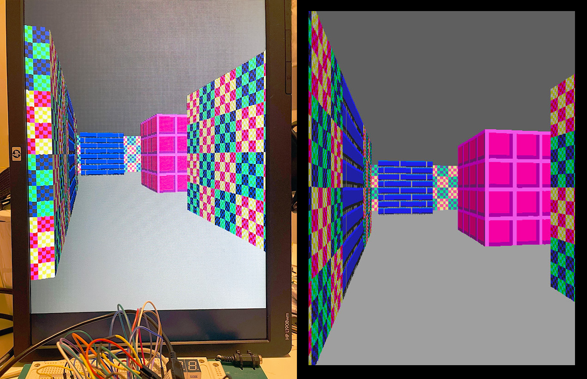
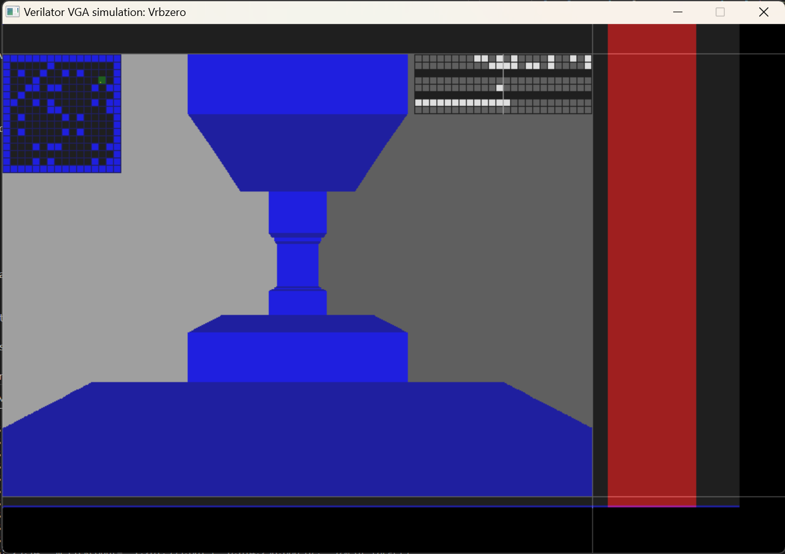

# Raybox Zero

This project is a minimalist ray caster (Wolf3D-like) VGA renderer in hardware, as a sort of primitive GPU, and besides targeting FPGAs it has been fabricated as part of at least one community ASIC (silicon chip) via the [Tiny Tapeout] program, (see [tt04-raybox-zero] and [tt07-raybox-zero]) plus [other silicon implementations](./game/doc/README.md).



This is the "baby cousin" of my original [Raybox] HDL ray caster design, but has other features that are not yet in Raybox.


## Version history

These are the notable versions of this project:

*   1.0: [TT04 submission](https://github.com/algofoogle/tt04-raybox-zero): ASIC has severe rendering glitches due to an OpenLane synthesis bug.
*   1.3 (not yet tagged): "EW" group submission to CI2311. Adds external SPI texture ROM option.
*   1.4 (not yet tagged): Group submission to GFMPW-1. Has some fixes and other new features.
*   1.5: [TT07 submission](https://github.com/algofoogle/tt07-raybox-zero): Expected to work properly on TT this time. Increased from 4x2 to 6x2.


## Controlling the design

*   For details about the raybox-zero chip interface signals (namely its two SPI peripheral channels), see: [tt04-raybox-zero]
*   For more details about different versions of raybox-zero that have been fabricated as ASICs, and ways to demo this hardware, see [the `game/` subdirectory](./game/) and [its documentation](./game/doc/README.md).


## Running Verilator simulation on Windows

I went through "[Setting up under Windows](https://github.com/algofoogle/raybox#setting-up-under-windows)" on a new Windows 11 machine,
but note that there were some quirks:
*   The MSYS2 installer I used was [msys2-x86_64-20230718.exe](https://github.com/msys2/msys2-installer/releases/download/2023-07-18/msys2-x86_64-20230718.exe) (July 2023).
*   When it ran the terminal at the end, it ran "MSYS2 UCRT64", but I'm not certain this was completely compatible with my instructions above, and so I switched to "MSYS2 MINGW64".
*   When Verilator gets installed, it doesn't seem to get a runnable `verilator` in the PATH by default, so I had to make sure the `Makefile` in this repo switches to using `verilator_bin.exe` instead when run under Windows.

Other than that, I can run the simulator with:

```ps
make clean_sim
```

When it's running, be sure to press the 'E' key to enable SPI control, or else you won't get any keyboard/mouse control over it.

NOTE: You can press the 'O' key to toggle your mouse orientiation to suit this landscape view (i.e. enabling up/down looking), or you can press 'P' to toggle portrait mode, and then use it like a normal 'first person shooter' view -- equivalent to physically turning your VGA monitor on its side.

You can also run `make clean_sim_random` which will start all uninitialised registers/memories with randomised data, but to get the random seed it relies on the 'Windows Time' service, so make sure that is started first.

This is an old screenshot before textures were implemented:




## Running Verilator simulation on Linux

**These instructions are tested with Ubuntu 20.04 LTS**, but are not yet complete because I'm using a VM that came preloaded with the build tools and Verilator v4.227.

Make sure SDL2 dev packages are installed:

```bash
sudo apt update
sudo apt install libsdl2-dev libsdl2-ttf-dev
```

Then build and run the simulation with:

```bash
make clean_sim
```

NOTE: As described for the Windows version above, be sure to use the 'E', 'O', and 'P' keys!


## Running on 8bitworkshop

The IDE at [8bitworkshop.com](https://8bitworkshop.com) is neat!

Sadly, the [Verilog (VGA @ 25 Mhz)](https://8bitworkshop.com/v3.10.1/?platform=verilog-vga) simulator can't run the design at this time. It comes up with an error `Error: extends width 64 != 32` which seems to stem from [here](https://github.com/sehugg/8bitworkshop/blob/70fdb6862244c0b5585d23a45ee08c57ec116a8f/src/common/hdl/vxmlparser.ts#L523) and is flagged in my `reciprocal` module on one of the multiplications.

I might see if there's something that can be done about this another time.

The [`8bw`](./8bw/) directory contains a top module (`rbzero_top`) that could otherwise be used to interface the main `rbzero` design with the 8bitworkshop simulator. It includes a `dither` module to go from RGB222 to RGB111.


## Differences from how Raybox was designed

### I/O constraints

These are some possible pinouts on TT04 or even more-constrained targets:

*   Standard pinout:
    *   All digital
    *   CLK and RESET
    *   8 inputs, 8 outputs, 8 bidir pins.
    *   26 total.
*   Constrained pinout:
    *   CLK and RESET
    *   2 RGB *analog* output pins
    *   2 sync digital outputs
    *   3 SPI peripheral pins (for host controller)
    *   4 SPI master pins (for RAM)
    *   13 total.
*   Super-constrained pinout:
    *   CLK and RESET
    *   4 SPI master pins (for RAM) -- use a "smart" peripheral that can provide both RAM and controller update registers.
    *   1 *analog* output pin -- composite video
    *   7 total.

### Tracing "rows" instead of "columns"

*   Column-tracing:
    *   A (say) 160x120 frame requires at least 6 bits of column height and 1 bit for side: 160x7 = 1120 bits.
    *   Add in 2-colour, and we need an extra bit: 160x8 = 1280 bits.
    *   Add in 32x32 textures, and we need at *least* an extra 5 bits: 160x13 = 2080 bits -- possibly more for scaling data.
*   Row-tracing:
    *   A (say) 512x480 frame requires 8 bits of column height and 1 bit for side, but potentially can be computed *per line*, so only 9 bits.
    *   Add in 8-colour, and we need an extra 3 bits.
    *   Add in 64x64 textures, and we need *at most* an extra 16 bits: ~28 bits total.
    *   NOTE: If we were IO-constrained, we could store texture data in external SPI RAM, and load the texture "row" into an internal
        64x6-bit buffer: 384 bits.
*   Note that with row-tracing we'd even have enough time to trace all during VBLANK and write them to external RAM, then
    pull individual row widths only when needed at the end of each line.
*   NOTE: Row-tracing doesn't HAVE to be only during HBLANK? Could be done during the whole line (for the next line).
    Same goes for external RAM access, *to an extent*.
*   Disadvantage: row-tracing is crappy. Wrong aspect ratio, and wrong orientation (unless you rotate the screen).

## Other modules

### Implemented

*   Basic row renderer (without texture mapping)
*   VGA RGB mux
*   LZC (hard-coded Q10.10)
*   Reciprocal approximator for Q10.10
*   tracer logic and FSM
*   map
*   view vectors (and SPI peripheral controller)
*   shared multiplier
*   debug overlay
*   external control pins

### Optional

*   texture SPI RAM master and local memory
*   debugging IO
*   temporal ordered dither -- done in de0nano wrapper

## Game ideas

*   With a VGA display that's physically rotated into portrait orientation, this can still be a classic Wolf3D-style FPS,
    despite having a strange aspect ratio. If that were REALLY a worry, we could restrict it to more of a square display.
*   Breakout-style game in 3D POV, but with up/down motion instead of left/right.
*   2D platformer extruded into 3D POV, e.g. Super Mario Bros, i.e. with gravity and jumping, and maybe even edge climbing.
    *   NOTE: Could be interesting to experiment with a higher-resolution map, such that each block is actually a much
        thinner strip that can be used to build more complex voxel-like structures.
*   "Descent"-style game but flying thru a flat up/down maze.

## Other things that MIGHT be possible without excessive extra logic

*   Distance shading (inc. for background).
*   Texture-mapped background (i.e. "floor/ceiling" texture mapping).
*   Dithering RGB222 to represent more like RGB444.
*   Some very primitive sprite overlays, even with centre-line displacement.
*   Displacement (left/right skew).

## Other ideas and notes

*   When tracing rows instead of columns, we don't need an immediate reciprocal, but could instead calculate it progressively
    as part of the FSM. This *might* allow for greater accuracy, and *could* also be a smaller amount of logic.
*   It would be cool if we had the option of changing vectors between rows (scanlines) so that we could potentially render different angles (split-screen)?
*   It's possible that we can read texture data from external SPI RAM (or SPI ROM), line by line, either into a local line-level buffer,
    or even by using two QSPI, because the address of a texture stripe can be loaded during HBLANK, and then each pixel clock transition
    can load the next (say) RGB222 (or even RGB332) whenever it is needed. However, pushing to full resolution (25MHz) might break down,
    and might get tricky if, for example, we need to skip some texels.
    *   Maybe I need to do a TT04 submission that is JUST a small RAM with 6-bit data I/O (for RGB222), address set serially (with auto-increment),
        and a few control pins to either set/reset the address, activate a write or read, set up/down mode, skip, ...?
    *   A single tile might (?) be able to hold ~80 words (of 6 bits) as simple DFFRAM: 8x8 image, or a map.
        Sanity check: If max. OpenRAM that fits in Caravel is 176,000 bits, then max in 1 tile is only ~230 bits.
    *   What if the interface we described above is actually just a generic controller for ANY external RAM?
        *   16-bit address via UO and UIO.
        *   Inputs: CLK, SetAddr, Gen (i.e. when SetAddr is not asserted, it is NOP/Inc; else it is an address bit to clock in).
    *   NOTE: This would be pretty easy to build with 7400-series logic.


[Raybox]: https://github.com/algofoogle/raybox
[Tiny Tapeout]: https://tinytapeout.com
[tt04-raybox-zero]: https://github.com/algofoogle/tt04-raybox-zero
[tt07-raybox-zero]: https://github.com/algofoogle/tt07-raybox-zero
