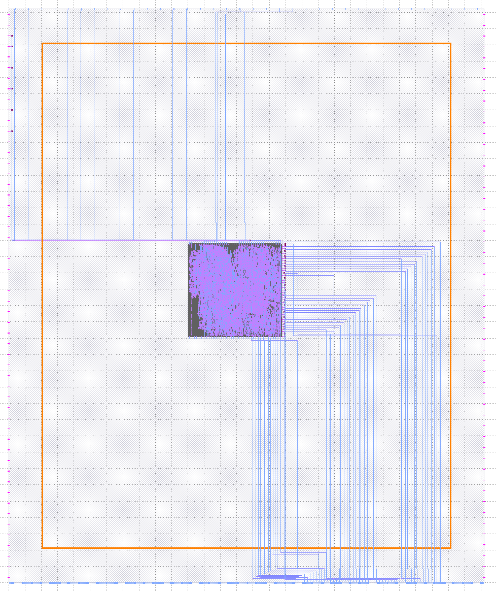

# Spec for Anton's design (`top_ew_algofoogle`)

## TL;DR

My macro (i.e. top module) is [`top_ew_algofoogle`](https://github.com/algofoogle/raybox-zero/blob/ew/src/rtl/top_ew_algofoogle.v). These are the main files as found in my repo ([raybox-zero-caravel](https://github.com/algofoogle/raybox-zero-caravel), a caravel_user_project based on tag `mpw-8c`):
*   GDS: [`gds/top_ew_algofoogle.gds.gz`](https://github.com/algofoogle/raybox-zero-caravel/blob/ew/gds/top_ew_algofoogle.gds.gz)
*   LEF: [`lef/top_ew_algofoogle.lef`](https://github.com/algofoogle/raybox-zero-caravel/blob/ew/lef/top_ew_algofoogle.lef)
*   DEF: [`def/top_ew_algofoogle.def`](https://github.com/algofoogle/raybox-zero-caravel/blob/ew/def/top_ew_algofoogle.def)

Full source is embedded in <code>[`verilog/rtl/`](https://github.com/algofoogle/raybox-zero-caravel/tree/ew/verilog/rtl)raybox-zero/</code> as a git submodule (`ew` branch).

I have alternatives for snippets that instantiate and wire up my macro in user_project_wrapper, depending on what we agree our IO pad sharing will be (Ref: [EW pin allocation](https://github.com/algofoogle/journal/blob/master/0165-2023-10-24.md#ew-pin-allocation)):

1.  :x: DO NOT USE: [`SNIPPET1_NoShare.v`](https://github.com/algofoogle/raybox-zero/blob/ew/src/rtl/ew_caravel_snippets/SNIPPET1_NoShare.v): Straight, simple, [9 dedicated IO pads for Anton](#if-only-9-pads-are-available-to-me-in-total).
2.  :white_check_mark: **THIS IS THE ONE: [`SNIPPET2_ShareIns.v`](https://github.com/algofoogle/raybox-zero/blob/ew/src/rtl/ew_caravel_snippets/SNIPPET2_ShareIns.v): 12-pads version, [Anton's 9, plus 3 extra shared INPUTS](#if-9-pads-available-plus-extra-sharedmuxed-inputs)**
3.  :x: NOT WRITTEN YET: `SNIPPET3_ShareMuxIO.v`: 13-pads version, [Anton's 9, plus shared/muxed INPUTS and OUTPUTS](#if-9-pads-available-plus-extra-sharedmuxed-inputs-and-outputs) (Matt's mux idea?) - **NOTE: Probably won't be needed; I don't think we'll do any muxing?**


There are suitable IO pad `user_defines` included in the header of each snippet above.

NOTE: Many of my macro's 125 pins will go unconnected in final placement -- the extras just support different wiring options so as to hopefully be flexible if we use a mux.

The design is purely-digital for now. I hope to still include a very simple analog portion, but can leave it out if I don't finish it soon.

My design [needs the Caravel SoC](#caravel-management-soc) to run firmware and control *up to* [51 LA pins](#logic-analyser-pins) (inputs into my design).

I think we'll be fine in terms of [clocking](#clocking) (i'm using `user_clock2`) and [holding in reset](#reset-lock) (should remain locked in reset until enabled by LA).


## Size

I guessed at 700x700&micro;m needed for my design.

I've tried hardening at different sizes/shapes, and settled on letting OpenLane pick: It's ended up at just under 600x600&micro;m.

(I used `FP_SIZING": "relative"` and `"FP_CORE_UTIL": 35`)


## Caravel Management SoC

Besides the clock and external pads, the design has 51 internal inputs that must be driven by the Caravel Managment SoC, running firmware. I'm intending to do this by using [51 of the internal Logic Analyser pins](#logic-analyser-pins) (all outputs from SoC, inputs to my design). Some are essential, but if 51 is too many, give me a target and I can cut it back.

I'm not using the Wishbone bus.


## Reset lock

So my design isn't free-running, it has to be explicitly 'enabled': I've got a reset 'lock' that is only released by two specific LA pins having *differing* values. In other words, the design's active-high reset is driven by the XNOR of those two chosen LA pins:

| LA[x] | LA[y] | reset                              |
|-------|-------|------------------------------------|
|   0   |   0   | 1 (asserted; design held in reset) |
|   1   |   1   | 1 (asserted; design held in reset) |
|   1   |   0   | 0 (released; design is running)    |
|   0   |   1   | 0 (released; design is running)    |

Irrespective of whether the LA pins start up all high, or all low, the design will be held in reset. Following power-on, I am *assuming* they won't all stay floating or in a random state. If they are, however, SoC firmware can rectify this.

<!-- CANCELLED: To further avoid trouble where the two LA signals might be floating, I plan to implement a sense on `la_oenb` to also force reset if the SoC is not actively driving the respective pair of signals. -->


## Clocking

My design's top module `i_clk` input port requires a clock of ~25MHz, 50% duty cycle. I don't think it matters where this comes from; I've *assumed* `user_clock2` is fine (as suggested by Ellen and John), but I don't yet know what the different clock sources are or the impact of choosing one over another. Can `user_clock2` be turned off by the SoC or Housekeeping module, perhaps? Otherwise the reset lock above should provide enough protection.


## Pads

***I will drop the analog part of my design for now.** If there is time in the coming days, I will see if I can get it in, but otherwise assume I will assign my analog pad to be a 9th digital pad instead.*


### If only 9 pads are available to me, in total

I have a Verilog snippet ([`SNIPPET1_NoShare.v`](https://github.com/algofoogle/raybox-zero/blob/ew/src/rtl/ew_caravel_snippets/SNIPPET1_NoShare.v)) that just instantiates my design with no sharing/mux support. In other words, it just directly uses the 9 pads I've been assigned, plus internal clock, plus 51 LA pins.

(Example implementation: See [user_project_wrapper in my repo's default `ew` branch](https://github.com/algofoogle/raybox-zero-caravel/blob/ew/verilog/rtl/user_project_wrapper.v#L85-L168))

My snippet uses convenience-mapping [of the IOs and LAs](https://github.com/algofoogle/raybox-zero/blob/9672184ec5f960ffd2758e46a9b73e9d57564685/src/rtl/ew_caravel_snippets/SNIPPET1_NoShare.v#L29-L36) so that these can easily be changed if needed, and also to ensure I don't accidentally overlap with someone else.

These are the user_defines (for IO pad power-on configuration) that I would prefer for the pads that have been assigned to me:

```verilog
`define USER_CONFIG_GPIO_18_INIT `GPIO_MODE_USER_STD_OUTPUT
`define USER_CONFIG_GPIO_19_INIT `GPIO_MODE_USER_STD_OUTPUT
`define USER_CONFIG_GPIO_20_INIT `GPIO_MODE_USER_STD_OUTPUT
`define USER_CONFIG_GPIO_21_INIT `GPIO_MODE_USER_STD_OUTPUT
`define USER_CONFIG_GPIO_22_INIT `GPIO_MODE_USER_STD_BIDIRECTIONAL
`define USER_CONFIG_GPIO_23_INIT `GPIO_MODE_USER_STD_OUTPUT
`define USER_CONFIG_GPIO_24_INIT `GPIO_MODE_USER_STD_OUTPUT
`define USER_CONFIG_GPIO_25_INIT `GPIO_MODE_USER_STD_INPUT_NOPULL
`define USER_CONFIG_GPIO_26_INIT `GPIO_MODE_USER_STD_INPUT_NOPULL
```

For reference, this is how the pads are assigned to the ports in my top module:

| IO Pad | Anton # | Dir | Top module port        |
|-------:|--------:|:---:|------------------------|
|     18 |       0 | Out | `o_hsync`              |
|     19 |       1 | Out | `o_vsync`              |
|     20 |       2 | Out | `o_tex_csb`            |
|     21 |       3 | Out | `o_tex_sclk`           |
|     22 |       4 | I/O | **Bi-dir**; in port: `i_tex_in[0]`; out port: `o_tex_out0` (activated by `o_tex_oeb0`==0) |
|     23 |       5 | Out | `o_gpout[0]`           |
|     24 |       6 | Out | `o_gpout[1]`           |
|     25 |       7 |  In | `i_tex_in[1]`          |
|     26 |       8 |  In | `i_tex_in[2]`          |
|        | 9 total |

>   **NOTE TO SELF**: In this snippet, I've assigned my highest LA signal (`anton_la_in[50]`) to be the driver of `i_tex_in[3]` internally, even though I don't yet have an implementation for that input in the design. At least that way if I *do* implement it, there's still a way to drive it rather than leave it floating.


### If 9 pads available PLUS extra shared/muxed INPUTS

Ellen advised that some digital inputs *might* be shareable between designs. If they're dedicated inputs, does this mean we can both just connect our designs to those pads directly, without needing a mux?

**If so,** I have a Verilog snippet ([`SNIPPET2_ShareIns.v`](https://github.com/algofoogle/raybox-zero/blob/ew/src/rtl/ew_caravel_snippets/SNIPPET2_ShareIns.v)) that instantiates my design with [9 dedicated pads](https://github.com/algofoogle/raybox-zero/blob/31b39e278dc5b64c31fd292c349bd27dab324267/src/rtl/ew_caravel_snippets/SNIPPET2_ShareIns.v#L43-L47), [4 shared inputs](https://github.com/algofoogle/raybox-zero/blob/31b39e278dc5b64c31fd292c349bd27dab324267/src/rtl/ew_caravel_snippets/SNIPPET2_ShareIns.v#L40-L41), plus [internal user_clock2](https://github.com/algofoogle/raybox-zero/blob/31b39e278dc5b64c31fd292c349bd27dab324267/src/rtl/ew_caravel_snippets/SNIPPET2_ShareIns.v#L72), plus [51 LA pins](https://github.com/algofoogle/raybox-zero/blob/31b39e278dc5b64c31fd292c349bd27dab324267/src/rtl/ew_caravel_snippets/SNIPPET2_ShareIns.v#L48-L50). My snippet uses convenience-mapping of the IO pads, shared inputs, and LAs as linked in this paragraph. Hence, these can easily be changed if needed, and it helps ensure I don't accidentally overlap with someone else.

(Example implementation: See [user_project_wrapper in my repo's default `ew-snippet2-test` branch](https://github.com/algofoogle/raybox-zero-caravel/blob/ew-snippet2-test/verilog/rtl/user_project_wrapper.v#L85-L171))

These are the user_defines (for IO pad power-on configuration) that I would prefer for the pads that have been assigned to me, if using this snippet:

```verilog
`define USER_CONFIG_GPIO_18_INIT `GPIO_MODE_USER_STD_OUTPUT
`define USER_CONFIG_GPIO_19_INIT `GPIO_MODE_USER_STD_OUTPUT
`define USER_CONFIG_GPIO_20_INIT `GPIO_MODE_USER_STD_OUTPUT
`define USER_CONFIG_GPIO_21_INIT `GPIO_MODE_USER_STD_OUTPUT
`define USER_CONFIG_GPIO_22_INIT `GPIO_MODE_USER_STD_BIDIRECTIONAL
`define USER_CONFIG_GPIO_23_INIT `GPIO_MODE_USER_STD_OUTPUT
`define USER_CONFIG_GPIO_24_INIT `GPIO_MODE_USER_STD_OUTPUT
`define USER_CONFIG_GPIO_25_INIT `GPIO_MODE_USER_STD_OUTPUT
`define USER_CONFIG_GPIO_26_INIT `GPIO_MODE_USER_STD_OUTPUT
// Assumed: IOs 35,34, 32,31 are configured already as `GPIO_MODE_USER_STD_INPUT_NOPULL
```

For reference, this is how the pads and shared inputs would be assigned to the ports in my top module:

| IO Pad | Anton # | Dir   | Top module port        |
|-------:|--------:|:-----:|------------------------|
|     18 |       0 |  Out  | `o_hsync`              |
|     19 |       1 |  Out  | `o_vsync`              |
|     20 |       2 |  Out  | `o_tex_csb`            |
|     21 |       3 |  Out  | `o_tex_sclk`           |
|     22 |       4 |  I/O  | **Bi-dir**; in port: `i_tex_in[0]`; out port: `o_tex_out0` (activated by `o_tex_oeb0`==0) |
|     23 |       5 |  Out  | `o_gpout[0]`           |
|     24 |       6 |  Out  | `o_gpout[1]`           |
|     25 |    **7**|**Out**| **`o_gpout[2]`**       |
|     26 |    **8**|**Out**| **`o_gpout[3]`**       |
|   31?  |     *9* | *In*  | `i_tex_in[1]` **(shared)** |
|   32?  |    *10* | *In*  | `i_tex_in[2]` **(shared)** |
|   34?  |    *11* | *In*  | `i_tex_in[3]` **(shared)** |
|        |12 total |

>   **NOTE TO SELF**: With 4 gpouts, if I *were* to get the DAC design working, I could put a DAC analog output on each of two gpouts (DAC input still selectable by gpout_sel via LA), and the other two gpouts could still output a *digital* 2-bit colour channel. For example: `gpo[1:0]` is digital Red, `gpo[2]` is analog Green, `gpo[3]` is analog Blue (but all sources for these can be switched via gpout_sel anyway).


## If 9 pads available PLUS extra shared/muxed INPUTS *and* OUTPUTS

Finally, if there are shareable pads that could easily mux OUTPUTS as well as INPUTS, I would do the following (adding `o_gpout[4]` and `o_gpout[5]`):

| IO Pad | Anton # | Dir   | Top module port        |
|-------:|--------:|:-----:|------------------------|
|     18 |      0  |  Out  | `o_hsync`              |
|     19 |      1  |  Out  | `o_vsync`              |
|     20 |      2  |  Out  | `o_tex_csb`            |
|     21 |      3  |  Out  | `o_tex_sclk`           |
|     22 |      4  |  I/O  | **Bi-dir**; in port: `i_tex_in[0]`; out port: `o_tex_out0` (activated by `o_tex_oeb0`==0) |
|     23 |      5  |  Out  | `o_gpout[0]`           |
|     24 |      6  |  Out  | `o_gpout[1]`           |
|     25 |      7  |  Out  | `o_gpout[2]`           |
|     26 |      8  |  Out  | `o_gpout[3]`           |
|     ?  |    **9**|**Out**| `o_gpout[4]` **(shared)** |
|     ?  |   **10**|**Out**| `o_gpout[5]` **(shared)** |
|     ?  |    *11* | *In*  | `i_tex_in[1]` **(shared)** |
|     ?  |    *12* | *In*  | `i_tex_in[2]` **(shared)** |
|        | 13 total |

NOTE: In this arrangement, I dropped my third input (`i_tex_in[3]`) because I don't really need it.


## Logic Analyser pins

I've nominated 51 LA signals below that the SoC will send to my design (i.e. they are inputs *into* my design).

These signals are numbered/listed in order of importance **(most important at the top)**. If this list needs to be cut short, **ideally the ones that don't make the cut would be hard-wired to GND**, which then selects sensible defaults in my design...

NOTE: In my instantiation Verilog snippets I've arbitrarily selected `la_data_in[114:64]` and used a convenience mapping to call them `anton_la_in[50:0]`. Hence, 0 below is LA[64], 1 below is LA[65], etc...

The following list of LA pins assumes [`SNIPPET2_ShareIns.v`](https://github.com/algofoogle/raybox-zero/blob/ew/src/rtl/ew_caravel_snippets/SNIPPET2_ShareIns.v) is the one used.

0.  `i_reset_lock_a`
1.  `i_reset_lock_b`
1.  `i_vec_csb`
1.  `i_vec_sclk`
1.  `i_vec_mosi`
1.  `i_gpout0_sel[0]`
1.  `i_gpout0_sel[1]`
1.  `i_gpout0_sel[2]`
1.  `i_gpout0_sel[3]`
1.  `i_gpout0_sel[4]`
1.  `i_gpout0_sel[5]`
1.  `i_debug_vec_overlay`
1.  `i_reg_csb`
1.  `i_reg_sclk`
1.  `i_reg_mosi`
1.  `i_gpout1_sel[0]`
1.  `i_gpout1_sel[1]`
1.  `i_gpout1_sel[2]`
1.  `i_gpout1_sel[3]`
1.  `i_gpout1_sel[4]`
1.  `i_gpout1_sel[5]`
1.  `i_gpout2_sel[0]`
1.  `i_gpout2_sel[1]`
1.  `i_gpout2_sel[2]`
1.  `i_gpout2_sel[3]`
1.  `i_gpout2_sel[4]`
1.  `i_gpout2_sel[5]`
1.  `i_debug_trace_overlay`
1.  `i_gpout3_sel[0]`
1.  `i_gpout3_sel[1]`
1.  `i_gpout3_sel[2]`
1.  `i_gpout3_sel[3]`
1.  `i_gpout3_sel[4]`
1.  `i_gpout3_sel[5]`
1.  `i_debug_map_overlay`
1.  `i_gpout4_sel[0]`
1.  `i_gpout4_sel[1]`
1.  `i_gpout4_sel[2]`
1.  `i_gpout4_sel[3]`
1.  `i_gpout4_sel[4]`
1.  `i_gpout4_sel[5]`
1.  `i_gpout5_sel[0]`
1.  `i_gpout5_sel[1]`
1.  `i_gpout5_sel[2]`
1.  `i_gpout5_sel[3]`
1.  `i_gpout5_sel[4]`
1.  `i_gpout5_sel[5]`
1.  `i_mode[0]`
1.  `i_mode[1]`
1.  `i_mode[2]`
1.  `i_reg_outs_enb` (`i_tex_in[3]` in SNIPPET1 version; no longer relevant)
1.  `i_spare_0`


## Macro Placement

`user_clock2` (my clock source) and LA inputs are all in the bottom-right corner, while my IO pads are in the top-left corner, so while testing my instantiation snippet, I placed my macro right in the middle of the user project area.

I used a custom `pin_order.cfg` to try and minimise wire lengths further.

Result:




## Questions

1.  Can our designs *simply share* digital *inputs* such that they don't need a mux? i.e. my design needs up to 3 digital inputs, and so does Ellen's, so can those drive both of our designs simultaneously, especially since our designs are otherwise independent?
1.  Does Matt feel my use of LAs and reset lock would pose any problems?
2.  Because my design needs to be close to `user_clock2` AND IO pads, would it be better for me to use pads that are [nearer the bottom-right](https://caravel-harness.readthedocs.io/en/latest/supplementary-figures.html#die-voltage-clamp-arrangement)? i.e. 8..16. Otherwise, should I create a macro that helps with buffering and routing?
3.  Is it OK how I've done pin ordering to try and match LAs and IOs (and esp `user_clock2`) a bit better? Should I plan to reharden my macro depending on where it gets placed, or if there is any change in the IOs we're all using?
5.  Is it possible to make the SoC single-step `user_clock2` in order to run tests/diagnostics?
6.  What's the likelihood that the SoC just won't work at all on every chip, e.g. won't run firmware?
7.  Is it bad that I've used mpw-8c caravel_user_project and OpenLane (Dec 2022)? This includes precheck.
8.  Antenna violations listed in `logs/signoff/*-antenna.log` that exceed 2x ratio: Are they real if not reported elsewhere? I've been getting about a 2.2x excess at times, though sometimes as high as 5x... yet they don't get reported as a warning or error.

## Things I would still like to do

1.  Write `SNIPPET3_ShareMuxIO.v` if I/O muxing is possible, to get 2 extra outputs.
2.  Do a few other minor improvements to my core `tt_ew_algofoogle` design; doable by end of Nov 2nd.


## Full list of macro pins

Many of these are not used, but they are still present around the edge of the macro.

1.  `o_gpout[0]`
1.  `o_gpout[1]`
1.  `o_gpout[2]`
1.  `o_gpout[3]`
1.  `o_gpout[4]`
1.  `o_gpout[5]`
1.  `o_tex_csb`
1.  `o_tex_sclk`
1.  `o_tex_oeb0`
1.  `o_tex_out0`
1.  `o_hsync`
1.  `o_vsync`
1.  `zeros[0]`
1.  `zeros[1]`
1.  `zeros[2]`
1.  `zeros[3]`
1.  `zeros[4]`
1.  `zeros[5]`
1.  `zeros[6]`
1.  `zeros[7]`
1.  `zeros[8]`
1.  `zeros[9]`
1.  `zeros[10]`
1.  `zeros[11]`
1.  `zeros[12]`
1.  `zeros[13]`
1.  `zeros[14]`
1.  `zeros[15]`
1.  `ones[0]`
1.  `ones[1]`
1.  `ones[2]`
1.  `ones[3]`
1.  `ones[4]`
1.  `ones[5]`
1.  `ones[6]`
1.  `ones[7]`
1.  `ones[8]`
1.  `ones[9]`
1.  `ones[10]`
1.  `ones[11]`
1.  `ones[12]`
1.  `ones[13]`
1.  `ones[14]`
1.  `ones[15]`
1.  `i_tex_in[0]`
1.  `i_tex_in[1]`
1.  `i_tex_in[2]`
1.  `i_tex_in[3]`
1.  `o_rgb[0]`
1.  `o_rgb[1]`
1.  `o_rgb[2]`
1.  `o_rgb[3]`
1.  `o_rgb[4]`
1.  `o_rgb[5]`
1.  `o_rgb[6]`
1.  `o_rgb[7]`
1.  `o_rgb[8]`
1.  `o_rgb[9]`
1.  `o_rgb[10]`
1.  `o_rgb[11]`
1.  `o_rgb[12]`
1.  `o_rgb[13]`
1.  `o_rgb[14]`
1.  `o_rgb[15]`
1.  `o_rgb[16]`
1.  `o_rgb[17]`
1.  `o_rgb[18]`
1.  `o_rgb[19]`
1.  `o_rgb[20]`
1.  `o_rgb[21]`
1.  `o_rgb[22]`
1.  `o_rgb[23]`
1.  `o_reset`
1.  `i_la_invalid`
1.  `i_reset_lock_a`
1.  `i_reset_lock_b`
1.  `i_vec_csb`
1.  `i_vec_sclk`
1.  `i_vec_mosi`
1.  `i_reg_csb`
1.  `i_reg_sclk`
1.  `i_reg_mosi`
1.  `i_gpout0_sel[0]`
1.  `i_gpout0_sel[1]`
1.  `i_gpout0_sel[2]`
1.  `i_gpout0_sel[3]`
1.  `i_gpout0_sel[4]`
1.  `i_gpout0_sel[5]`
1.  `i_gpout1_sel[0]`
1.  `i_gpout1_sel[1]`
1.  `i_gpout1_sel[2]`
1.  `i_gpout1_sel[3]`
1.  `i_gpout1_sel[4]`
1.  `i_gpout1_sel[5]`
1.  `i_gpout2_sel[0]`
1.  `i_gpout2_sel[1]`
1.  `i_gpout2_sel[2]`
1.  `i_gpout2_sel[3]`
1.  `i_gpout2_sel[4]`
1.  `i_gpout2_sel[5]`
1.  `i_gpout3_sel[0]`
1.  `i_gpout3_sel[1]`
1.  `i_gpout3_sel[2]`
1.  `i_gpout3_sel[3]`
1.  `i_gpout3_sel[4]`
1.  `i_gpout3_sel[5]`
1.  `i_gpout4_sel[0]`
1.  `i_gpout4_sel[1]`
1.  `i_gpout4_sel[2]`
1.  `i_gpout4_sel[3]`
1.  `i_gpout4_sel[4]`
1.  `i_gpout4_sel[5]`
1.  `i_gpout5_sel[0]`
1.  `i_gpout5_sel[1]`
1.  `i_gpout5_sel[2]`
1.  `i_gpout5_sel[3]`
1.  `i_gpout5_sel[4]`
1.  `i_gpout5_sel[5]`
1.  `i_debug_vec_overlay`
1.  `i_debug_trace_overlay`
1.  `i_debug_map_overlay`
1.  `i_clk`
1.  `i_test_wb_clk_i`
1.  `i_mode[0]`
1.  `i_mode[1]`
1.  `i_mode[2]`
1.  `i_reg_outs_enb`
1.  `i_spare_0`
1.  `i_spare_1`


## NOTES TO SELF

These are intended just for Anton's own reference.

### gpout selector values

0.  primary; different depending on gpout:
    | gpout | primary    |
    |-------|------------|
    | [0]   | green_lo   |
    | [1]   | greeen_hi  |
    | [2]   | red_lo     |
    | [3]   | red_hi     |
    | [4]   | blue_lo    |
    | [5]   | blue_hi    |
1.  alt; different depending on gpout:
    | gpout | alt                 |
    |-------|---------------------|
    | [0]   | rbzero_reset        |
    | [1]   | wb_clk_i            |
    | [2]   | i_reset_lock_a      |
    | [3]   | i_reset_lock_b      |
    | [4]   | i_debug_vec_overlay |
    | [5]   | 0                   |
2.  clk
3.  clk/4
4.  tex_in[3]
5.  vec_csb
6.  vec_sclk
7.  vec_mosi
8.  rgb[0]
9.  rgb[1]
10. rgb[2]
11. rgb[3]
12. rgb[4]
13. rgb[5]
14. rgb[6]
15. rgb[7]
16. rgb[8]
17. rgb[9]
18. rgb[10]
19. rgb[11]
20. rgb[12]
21. rgb[13]
22. rgb[14]
23. rgb[15]
24. rgb[16]
25. rgb[17]
26. rgb[18]
27. rgb[19]
28. rgb[20]
29. rgb[21]
30. rgb[22]
31. rgb[23]
32. reg_csb
33. reg_sclk
34. reg_mosi
35. hblank
36. vblank
37. tex_oeb0
38. tex_in[0]
39. tex_in[1]
40. tex_in[2]
41. mode[0]
42. mode[1]
43. mode[2]
44. hpos[0]
45. hpos[1]
46. hpos[2]
47. hpos[3]
48. hpos[4]
49. hpos[5]
50. hpos[6]
51. hpos[7]
52. hpos[8]
53. hpos[9]
54. vpos[0]
55. vpos[1]
56. vpos[2]
57. vpos[3]
58. vpos[4]
59. vpos[5]
60. vpos[6]
61. vpos[7]
62. vpos[8]
63. vpos[9]
