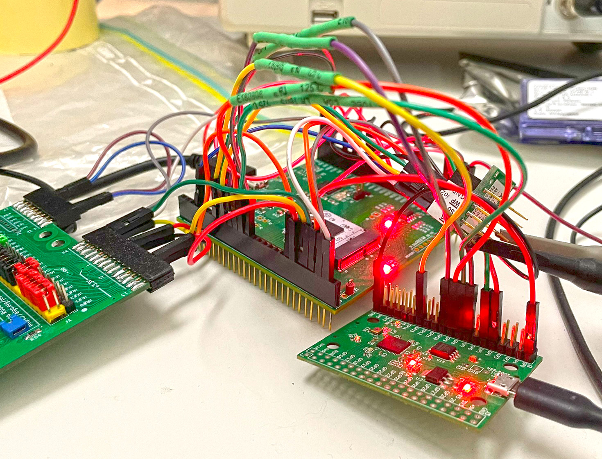

# Testing Raybox-zero CI2311 chips

## Overview


This documentation is a work-in-progress. The short story is that Raybox-zero (RBZ) works in the CI2311 (Efabless chipIgnite November 2023) group project submission I did, and it can be controlled via the Caravel RISC-V CPU. With the code provided, it's possible to use your keyboard and mouse to control your POV (point-of-view) and move around the game map.

Journal [0208](https://github.com/algofoogle/journal/blob/master/0208-2024-07-05.md) has my initial chip bring-up notes.

RBZ is pin-constrained in CI2311:
*   As a 'shared chip', externally I had only 10 IOs, and 4 additional input-only pins to work with.
*   Essential external functions (clock, VGA output, texture ROM) use the available pins.
*   Other functions (2x SPI interfaces and other mode/debug selection) use internal Caravel LA pins and have to be bit-banged by firmware running on the Caravel RISC-V CPU.

4 of the external pins are called `gpout`s, i.e. general-purpose outputs, and while their default config is to output some VGA colour data, firmware can reconfigure them (via LA pins) to output other signals, mostly for debugging.

This version of RBZ supports:
*   Switching wall texture maps between internally-generated patterns and external SPI ROM.
*   Extended 'registers' inc. `VINF` (infinite wall height mode), texture offsets, and 'other' block.

## Using the demo

The code in the [game/raybox_game/](../raybox_game/) directory is an evolution of [the same code for TT04](https://github.com/algofoogle/tt04-raybox-zero/tree/main/demoboard).

Here's how you "play" RBZ...

### Setting up

NOTE: [Wiring diagrams](#pcb-wiring-diagrams) are provided below to show what specific connections are required.

*   Put a CI2311 "slot A6" chip in the [Caravel eval board](https://github.com/efabless/caravel_board) and plug the board into your PC via USB.
*   Compile the [ci2311-firmware.c](../raybox_game/ci2311-firmware.c) Caravel firmware and flash it to the eval board. I need to write better instructions, but [the HKDebug demo guide](https://github.com/efabless/caravel_board/tree/main/firmware/chipignite/demos) can help until then.
    *   NOTE: There is code for setting the Caravel CPU clock speed to 50MHz in [ci2311-firmware.c](../raybox_game/ci2311-firmware.c) **but it is currently commented out**.
    *   This was probably commented out for a test and can (*should*) probably be brought back to ensure full-speed operation.
    *   When the Caravel CPU clock is at 50MHz, the hard-wired baud rate of the Caravel UART will be 48000 (i.e. at *10MHz* it is a nominal 9600 baud).
    *   raybox_peripheral_ci2311.py expects 48000 baud; changing the Caravel CPU clock speed changes the Caravel UART baud rate, so raybox_peripheral_ci2311.py would need to be updated to reflect this.
*   Wire up vccd2 (which is RBZ's specific power rail) to 1.8V.
*   Wire up a VGA DAC.
*   Wire up an RP2040 running MicroPython, providing PC-to-Caravel UART bridge, clock generator, and a couple extra debug pins.
*   Plug in the RP2040 via USB to your PC.
*   Create a Python VENV and do `pip install -r requirements.txt` per [requirements.txt](../requirements.txt).
*   Optionally wire up a texture SPI ROM.
*   Attach a VGA monitor
*   Run this MicroPython code (e.g. via Thonny) on the RP2040 to start the RBZ clock source:
    ```python
    from machine import UART, Pin, PWM
    io0 = Pin(0, Pin.OUT)
    pwm = PWM(io0)
    pwm.freq(25_000_000)
    pwm.duty_u16(0x8000)
    ```
*   Hopefully you'll see a display of some kind, though it might be a little messed up...

Press the RESET button on the Caravel eval board and you should see the image below. Note that without a texture SPI ROM the walls will probably be black; there's a way to switch to internally-generated textures (`gen_tex`, via internal LA pin) but we'll worry about that later.


The Caravel firmware as flashed above is asserting the RBZ reset line and bit-banging this specific POV.


### Running the demo

Make sure Thonny or similar isn't already connected to the RP2040's USB COM port.

When you run `python3 raybox_game.py`, you should get a window that looks like this:


You should now be able move around the game map with your keyboard and mouse (typical FPS controls) and see your POV on the VGA display.


### How it works

At a very high level, the chain is like this:

1.  Host PC: raybox_game
2.  Host PC: raybox_controller (just a lib imported by raybox_game)
3.  RP2040 (via USB-Serial): raybox_peripheral_ci2311
4.  RBZ Caravel CPU (via Caravel UART): ci2311-firmware
5.  RBZ "chip" (via internal LA pins)

In more detail:

*   [raybox_game.py](../raybox_game/raybox_game.py) runs on the host PC.
    *   It's a Pygame script that takes keyboard/mouse input and converts it to game action & POV.
    *   It knows the 'game map' that is hardwired into the RBZ chip, and handles motion and collision detection.
*   [raybox_controller.py](../raybox_game/raybox_controller.py) is a lib imported by raybox_game to abstract various RBZ "peripherals" (wrapper/controller hardware, namely RP2040).
*   [raybox_peripheral_ci2311.py](../raybox_game/raybox_peripheral_ci2311.py) is code that will run on the CI2311-specific RBZ peripheral.
    *   raybox_controller reads this code and pushes it via USB-serial to MicroPython on the RP2040.
    *   This code provides an interface, that can be directed over USB-serial, to control the RBZ peripheral.
    *   It generates the RBZ clock source on GPIO0, sets up UART comms to the Caravel CPU, and controls a few other GPIOs as 'soft' (firmware-polled) signals into the chip.
*   When raybox_game knows the POV to be shown at any given moment in time (not strictly 'frames'; the RBZ chip displays whatever POV is currently 'ready' when it starts to render its next frame), it will send the state update via raybox_controller:
    *   raybox_controller sends the state as MicroPython commands via USB-Serial.
*   The MicroPython code on the RP2040 uses the UART interface (via GP4 and 5) to send encoded POV/reg data to the Caravel UART interface (as well as a few other 'soft' control signals)
*   [ci2311-firmware.c](../raybox_game/ci2311-firmware.c) is flashed to the firmware ROM of the Caravel eval board, providing the control bridge to the internal RBZ signals. Its purpose is to:
    *   Alter the Caravel GPIOs to support some extra soft input signals.
    *   Take over the LA pins, especially to reset RBZ.
    *   Configure the DLL to get it running at 50MHz.
    *   Set up Caravel UART and enter a loop of waiting for update 'commands' (very lightweight) and data to bit-bang via LA to RBZ.
    *   Monitor the 'soft' GPIOs and converts their state to LA pin states (e.g. to turn debug/gen_tex/inc_px on and off).


## PCB wiring diagrams

Here's how I have the boards wired together:


I'll do a proper schematic later, too.

Note the following:
*   On the Caravel eval board, J11 has 1V8 wired to vccd2 -- the latter is the core power rail for RBZ.
*   IOs in the range 33:27 that are prefixed with `sw_...` are reconfigured via the firmware to make them inputs that are then polled to translate into respective RBZ signals via LA pins.
*   Resetting using the eval board's `/RST` will reset the firmware, which *in turn* resets RBZ. It is not a direct RBZ reset.
*   The firmware also selects which gpouts we want on `IO[20:17]`, in this case the 2 blue channel bits and 2 red channel bits.
*   Red channel bits are repeated to green channel bits (see DAC J3), making a 16-colour palette comprising blues, greys, and yellows.
*   Main data transfer from RP2040 to Caravel chip (for RBZ internal SPI control of POV and 'registers') is via firmware+UART on `IO[6:5]`


## Notes

*   Given this has an external clock input, you can vary the RBZ clock independently of the Caravel CPU clock.
*   The host PC's Python code automatically runs MicroPython code on the RP2040 to get the clock running.
*   There are settings in the Python code that allow you to flip your input/view. That is, if you haven't rotated your monitor (or depending on the direction you have rorated it) you can set how your keyboard/mouse inputs translate to vectors so motion matches what you expect.

## Photos

Here are more photos from different angles to help with figuring out where everything goes:




